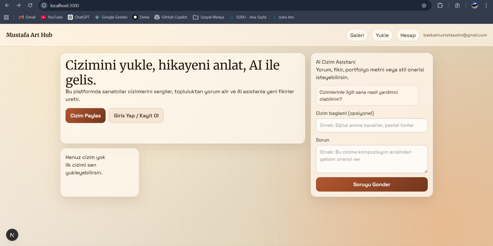

# Mustafa Art Hub (Next.js + Supabase + OpenAI)

Bu proje, kullanicilarin cizimlerini sergileyebilecegi, yorum/begeni alabilecegi ve AI asistandan yardim alabilecegi bir MVP'dir.

## Ekran Goruntusu



## Neler var?

- E-posta/sifre ile kayit ve giris
- Cizim yukleme (Supabase Storage)
- Galeri + cizim detay sayfasi
- Yorum ve begeni sistemi
- ChatGPT tabanli AI yardimci (OpenAI API)
- Admin moderasyon paneli (cizim/yorum gizle-ac)
- Basit API rate limit (AI + yorum)

## 1) Gereksinimler

- Node.js 20+
- Bir Supabase projesi
- OpenAI API key

## 2) Kurulum

```bash
npm install
copy .env.example .env.local
npm run dev
```

`.env.local` icine kendi degerlerini yaz:

```env
NEXT_PUBLIC_SUPABASE_URL=https://your-project-id.supabase.co
NEXT_PUBLIC_SUPABASE_ANON_KEY=your_supabase_anon_key
SUPABASE_SERVICE_ROLE_KEY=your_service_role_key
OPENAI_API_KEY=your_openai_api_key
ADMIN_EMAILS=admin1@mail.com,admin2@mail.com
```

## 3) Supabase SQL (Table + Trigger + RLS)

Supabase SQL Editor'de asagidaki scripti calistir:

```sql
create extension if not exists pgcrypto;

create table if not exists public.profiles (
  id uuid primary key references auth.users(id) on delete cascade,
  username text unique,
  avatar_url text,
  created_at timestamptz default now()
);

create table if not exists public.artworks (
  id uuid primary key default gen_random_uuid(),
  user_id uuid not null references auth.users(id) on delete cascade,
  title text not null,
  description text,
  image_path text not null,
  image_url text not null,
  tags text[] default '{}',
  is_hidden boolean not null default false,
  created_at timestamptz default now()
);

create table if not exists public.artwork_likes (
  artwork_id uuid not null references public.artworks(id) on delete cascade,
  user_id uuid not null references auth.users(id) on delete cascade,
  created_at timestamptz default now(),
  primary key (artwork_id, user_id)
);

create table if not exists public.artwork_comments (
  id uuid primary key default gen_random_uuid(),
  artwork_id uuid not null references public.artworks(id) on delete cascade,
  user_id uuid not null references auth.users(id) on delete cascade,
  content text not null check (char_length(content) <= 500),
  is_hidden boolean not null default false,
  created_at timestamptz default now()
);

create or replace function public.handle_new_user()
returns trigger
language plpgsql
security definer set search_path = public
as $$
begin
  insert into public.profiles (id, username)
  values (new.id, split_part(new.email, '@', 1))
  on conflict (id) do nothing;
  return new;
end;
$$;

drop trigger if exists on_auth_user_created on auth.users;
create trigger on_auth_user_created
after insert on auth.users
for each row execute procedure public.handle_new_user();

alter table public.profiles enable row level security;
alter table public.artworks enable row level security;
alter table public.artwork_likes enable row level security;
alter table public.artwork_comments enable row level security;

create policy "Public profiles read"
on public.profiles for select
to anon, authenticated
using (true);

create policy "Users insert own profile"
on public.profiles for insert
to authenticated
with check (auth.uid() = id);

create policy "Users update own profile"
on public.profiles for update
to authenticated
using (auth.uid() = id)
with check (auth.uid() = id);

create policy "Public artworks read only visible"
on public.artworks for select
to anon, authenticated
using (is_hidden = false or auth.uid() = user_id);

create policy "Users insert own artworks"
on public.artworks for insert
to authenticated
with check (auth.uid() = user_id);

create policy "Users update own artworks"
on public.artworks for update
to authenticated
using (auth.uid() = user_id)
with check (auth.uid() = user_id);

create policy "Users delete own artworks"
on public.artworks for delete
to authenticated
using (auth.uid() = user_id);

create policy "Public likes read"
on public.artwork_likes for select
to anon, authenticated
using (true);

create policy "Users manage own likes"
on public.artwork_likes for all
to authenticated
using (auth.uid() = user_id)
with check (auth.uid() = user_id);

create policy "Public comments read visible"
on public.artwork_comments for select
to anon, authenticated
using (is_hidden = false or auth.uid() = user_id);

create policy "Users insert own comments"
on public.artwork_comments for insert
to authenticated
with check (auth.uid() = user_id);

create policy "Users update own comments"
on public.artwork_comments for update
to authenticated
using (auth.uid() = user_id)
with check (auth.uid() = user_id);

create policy "Users delete own comments"
on public.artwork_comments for delete
to authenticated
using (auth.uid() = user_id);
```

## 4) Supabase Storage Bucket

Storage'da `artworks` adinda **public** bucket olustur.

```sql
create policy "Public can read artwork files"
on storage.objects for select
to anon, authenticated
using (bucket_id = 'artworks');

create policy "Authenticated can upload artwork files"
on storage.objects for insert
to authenticated
with check (bucket_id = 'artworks');

create policy "Authenticated can update own artwork files"
on storage.objects for update
to authenticated
using (bucket_id = 'artworks' and owner = auth.uid())
with check (bucket_id = 'artworks' and owner = auth.uid());

create policy "Authenticated can delete own artwork files"
on storage.objects for delete
to authenticated
using (bucket_id = 'artworks' and owner = auth.uid());
```

## 5) Guvenlik ve Maliyet

- OpenAI API key sadece server tarafinda kullanilir (`src/app/api/ai/route.ts`).
- `SUPABASE_SERVICE_ROLE_KEY` sadece server'da admin endpoint/panel icin kullanilir.
- AI endpoint ve yorum endpoint icin basit rate limit var (memory tabanli).
- Upload tarafinda istemci dosya turu/boyut kontrolu var (PNG/JPEG/WEBP, max 5MB).

## 6) Gelistirme Komutlari

```bash
npm run dev
npm run lint
npm run build
```

## Proje yapisi

- `src/app/page.tsx` -> galeri + AI asistan
- `src/app/artworks/[id]/page.tsx` -> detay + yorum/begeni
- `src/app/upload/page.tsx` -> cizim yukleme
- `src/app/auth/page.tsx` -> giris/kayit
- `src/app/admin/page.tsx` -> admin moderasyon paneli
- `src/app/api/ai/route.ts` -> OpenAI baglantisi
- `src/app/api/artworks/[id]/like/route.ts` -> begeni toggle
- `src/app/api/artworks/[id]/comments/route.ts` -> yorum ekleme
- `src/app/api/admin/**` -> moderasyon endpoint'leri
